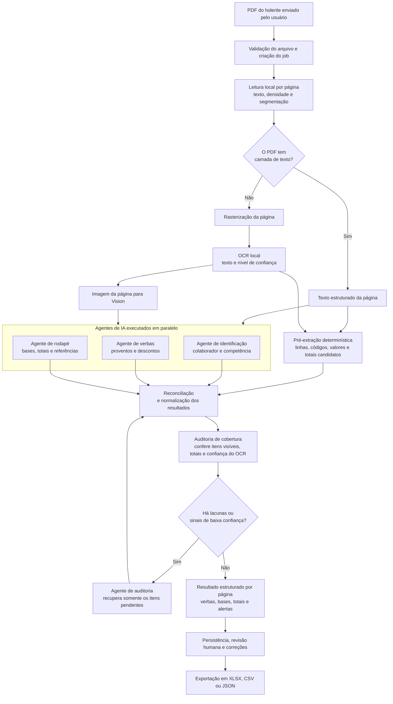

# Quick Filler — Folha de Pagamento

Aplicação web para extrair dados de holerites em PDF, revisar a transcrição ao lado do documento e exportar uma planilha corrigida.

## Produção

Aplicação publicada em: https://desafio-programador.vercel.app/

## Como a extração funciona



O roteamento é feito por página: PDFs com texto seguem para os agentes com a camada textual; PDFs escaneados passam por rasterização, OCR local e Vision. Os agentes especializados dividem a leitura em identificação, verbas e rodapé. Depois, uma auditoria compara o que foi extraído com os itens detectados localmente e aciona um agente de recuperação apenas quando necessário.

Em produção, a API retorna `202 Accepted` e conclui o processamento em segundo plano. Cada página extraída é persistida separadamente, permitindo acompanhar o progresso e retomar a execução sem reprocessar as páginas concluídas.

## Fluxo

`enviar holerite → processar em segundo plano → revisar → baixar XLSX, CSV ou JSON`

O envio cria um job assíncrono e retorna `202 Accepted`. Todo dado transcrito é produzido pela OpenAI: PDFs textuais enviam texto preparado e PDFs escaneados enviam imagens via Vision. O processamento local apenas mede densidade, segmenta e rasteriza para definir a estratégia e a quantidade de prompts. Sem OpenAI configurada ou disponível, o job falha explicitamente. Antes de persistir, o resultado é normalizado para preservar valores monetários como strings brasileiras e separar verbas (`fields`) de bases e totais (`bases`).

## Executar localmente

```bash
npm install
$env:OPENAI_API_KEY = "sua_chave"
npm run dev
```

Ou com Docker:

```bash
$env:OPENAI_API_KEY = "sua_chave"
docker compose up --build
```

## API

- `POST /api/transcricoes` — recebe `arquivo` (PDF) e `tipo=holerite`.
- `GET /api/transcricoes/:id` — consulta o job.
- `PUT /api/transcricoes/:id` — salva correções.
- `GET /api/transcricoes/:id/planilha?formato=xlsx|csv|json` — baixa a exportação.
- `GET /healthz` — healthcheck.

Mais detalhes de stack, segurança, decisões e limitações estão em [SOLUCAO.md](SOLUCAO.md). O custo e as estratégias de extração estão em [FINOPS.md](FINOPS.md).
