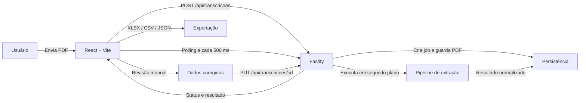
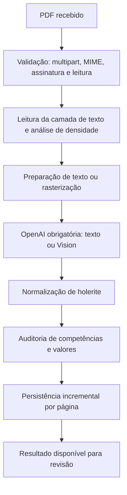
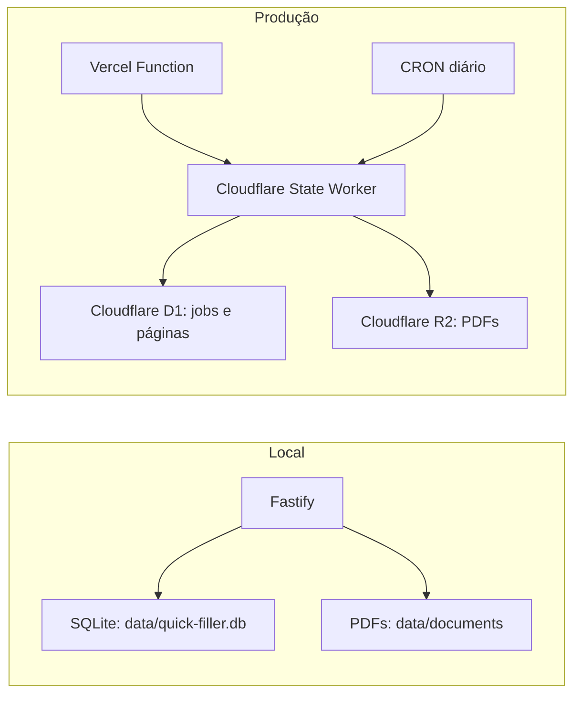

# Visão técnica do sistema

Este repositório contém o **Quick Filler — Folha de Pagamento**, uma aplicação web que recebe holerites em PDF, extrai dados estruturados, permite a conferência humana e gera arquivos de exportação.

> Escopo implementado: a API e a interface aceitam atualmente somente `tipo=holerite`. Há utilitários, exemplos e requisitos para cartão de ponto, mas esse fluxo não está exposto como funcionalidade completa da aplicação.

## Fluxo do produto



O upload responde com **HTTP 202** para não prender a requisição durante uma extração longa. A interface consulta o status do job até que ele termine ou falhe.

## Arquitetura de extração



- PDFs com camada de texto são analisados localmente somente para preparar e dimensionar os prompts enviados à OpenAI.
- PDFs escaneados são rasterizados e enviados ao modo Vision. Nenhum dos dois fluxos transcreve dados sem OpenAI.
- Fichas financeiras são detectadas e divididas em blocos mensais antes da extração.
- A normalização preserva valores monetários como texto no formato brasileiro e separa `fields` (verbas) de `bases` e totais.
- Resultados de páginas são salvos durante o processamento. Isso permite retomar jobs interrompidos sem refazer páginas já concluídas.

## Estrutura do repositório

```text
desafio-programador/
├── src/
│   ├── client/                 # Interface React
│   │   ├── App.jsx             # Estado principal, upload, polling e revisão
│   │   └── components/         # Upload, progresso, PDF, tabela e exportação
│   ├── routes/                 # Contrato HTTP das transcrições
│   ├── services/               # Orquestração de IA e persistência de jobs
│   ├── normalizers/            # DTO e regras de normalização do holerite
│   ├── utils/                  # PDF, segmentação, densidade, validação e XLSX
│   ├── config/                 # Leitura de variáveis de ambiente
│   └── server.js               # Bootstrap do Fastify
├── api/index.js                # Adaptador Fastify para Vercel Functions
├── cloudflare/state-worker.js  # API privada de estado para produção
├── migrations/                 # Esquema D1 para jobs e páginas
├── tests/                      # Testes do pipeline, API e exportação
├── exemplos/                   # PDFs e resultados de referência
├── scripts/                    # Benchmark e verificação de deploy
├── Dockerfile                  # Imagem de produção Node 22
├── docker-compose.yml          # Execução local em contêiner
├── vercel.json                 # Build, rotas e timeout da Function
└── wrangler.jsonc              # Worker Cloudflare, D1, R2 e limpeza diária
```

Arquivos de referência importantes:

- [README.md](README.md): instruções rápidas, endpoints e execução local.
- [SOLUCAO.md](SOLUCAO.md): decisões, escopo entregue e limitações.
- [PROCESSO.md](PROCESSO.md): histórico de desenvolvimento e uso de IA.
- [FINOPS.md](FINOPS.md): estratégia de custo e recomendações de observabilidade.
- [INSTRUCOES.md](INSTRUCOES.md): requisitos originais do desafio.

## Stack

| Camada | Tecnologias | Responsabilidade |
|---|---|---|
| Frontend | React 19, Vite 8 | Upload, acompanhamento, revisão e download |
| Backend | Node.js 22, Fastify 5 | API HTTP, validação de upload e jobs assíncronos |
| IA / OCR | OpenAI SDK, Vision | Extração de texto estruturado de PDFs e imagens |
| Processamento PDF | `pdf.js-extract`, `pdfjs-dist`, `pdf-to-img`, Canvas | Leitura textual, segmentação e rasterização |
| Exportação | ExcelJS | Geração de XLSX; CSV e JSON nativos |
| Persistência local | SQLite nativo do Node | Jobs, páginas e PDFs no diretório `data/` |
| Produção | Vercel Functions + Cloudflare Worker, D1 e R2 | API pública, estado durável e armazenamento de documentos |
| Empacotamento | Docker / Docker Compose | Ambiente local reproduzível |

## Persistência e execução por ambiente



Em produção, `STATE_API_URL` e `STATE_API_TOKEN` são obrigatórios. O backend acessa o Worker com token Bearer; o Worker mantém metadados no D1 e os PDFs no R2. O agendamento do Worker remove jobs e arquivos expirados.

No modo local, SQLite e o sistema de arquivos guardam o estado. A retenção padrão é de 24 horas para limpeza local, enquanto novos jobs recebem expiração padrão de 90 dias para o fluxo persistido; ambos os valores podem ser configurados por variáveis de ambiente.

## Contrato da API

| Método e rota | Finalidade |
|---|---|
| `POST /api/transcricoes` | Recebe `arquivo` PDF e `tipo=holerite`; cria job e retorna `202` + id |
| `GET /api/transcricoes` | Lista jobs salvos |
| `GET /api/transcricoes/:id` | Retorna status, progresso, erro e resultado |
| `PUT /api/transcricoes/:id` | Persiste as correções feitas na revisão |
| `GET /api/transcricoes/:id/arquivo` | Exibe o PDF original salvo |
| `POST /api/transcricoes/:id/retomar` | Reprocessa apenas páginas pendentes |
| `DELETE /api/transcricoes/:id` | Remove job, páginas e PDF |
| `GET /api/transcricoes/:id/planilha?formato=xlsx\|csv\|json` | Baixa a transcrição exportada |
| `GET /healthz` | Healthcheck |

## Modelo de dados principal

O resultado entregue à interface segue, em essência, este formato:

```json
{
  "pages": [
    {
      "page": 1,
      "month": "05",
      "year": "2026",
      "fields": [{ "code": "001", "label": "Salário Base", "reference": "30", "value": "3.200,00", "type": "provento" }],
      "bases": [{ "label": "Base INSS", "value": "3.200,00" }]
    }
  ],
  "audit": {}
}
```

Páginas da mesma competência podem ser unificadas. A exportação monta as colunas a partir da primeira ocorrência de cada verba e destaca competência não sequencial, dados vazios ou valores com `?`.

## Configuração e operação

Para desenvolvimento:

```powershell
npm install
$env:OPENAI_API_KEY = "sua_chave"
npm run dev
```

Alternativa com contêiner:

```powershell
$env:OPENAI_API_KEY = "sua_chave"
docker compose up --build
```

Variáveis relevantes:

| Variável | Uso |
|---|---|
| `OPENAI_API_KEY` ou `OPENAI_SECRET_KEY` | Obrigatória para qualquer transcrição, textual ou Vision |
| `PORT`, `HOST`, `LOG_LEVEL` | Configuração do servidor Fastify |
| `APP_ENV=production` / `VERCEL` | Ativa o modo de produção |
| `STATE_API_URL`, `STATE_API_TOKEN` | Persistência remota obrigatória em produção |
| `STATE_API_TIMEOUT_MS` | Timeout para chamadas ao Worker de estado |
| `TRANSCRIPTION_RETENTION_HOURS` | Retenção no armazenamento local |
| `SAVED_EXTRACTION_RETENTION_DAYS` | Validade de jobs e arquivos persistidos |

Comandos de verificação úteis: `npm test`, `npm run benchmark:payroll01` e `npm run build`.

## Segurança e pontos de atenção

- O upload exige `multipart/form-data`, MIME `application/pdf`, assinatura `%PDF-`, arquivo legível e limite de 50 MB.
- Não versionar chaves de API ou tokens. Em produção, mantenha `STATE_API_TOKEN` diferente da chave OpenAI.
- PDFs de holerite contêm PII; a retenção deve seguir a política de privacidade aplicável. A exclusão por `DELETE` remove o job e seu arquivo associado.
- O CORS atual aceita qualquer origem (`origin: true`); para um ambiente público, convém restringi-lo ao domínio da aplicação.
- Toda transcrição depende da disponibilidade da OpenAI. O processamento local não produz uma transcrição alternativa.
- O `vercel.json` define duração máxima de 300 segundos. Documentos muito grandes, limites do provedor ou falhas transitórias continuam sendo riscos operacionais; a persistência incremental e a rota de retomada reduzem esse impacto.

## Próximas evoluções sugeridas

1. Concluir o fluxo real de cartão de ponto, reutilizando o pipeline comum já existente.
2. Registrar modelo, tokens, latência e custo de cada chamada de IA.
3. Adicionar cache por hash do PDF para evitar reprocessamentos idênticos.
4. Restringir CORS e acrescentar autenticação/autorização real antes de exposição pública.
5. Avaliar um provedor especializado em documentos como fallback para reduzir a dependência de um único serviço.
